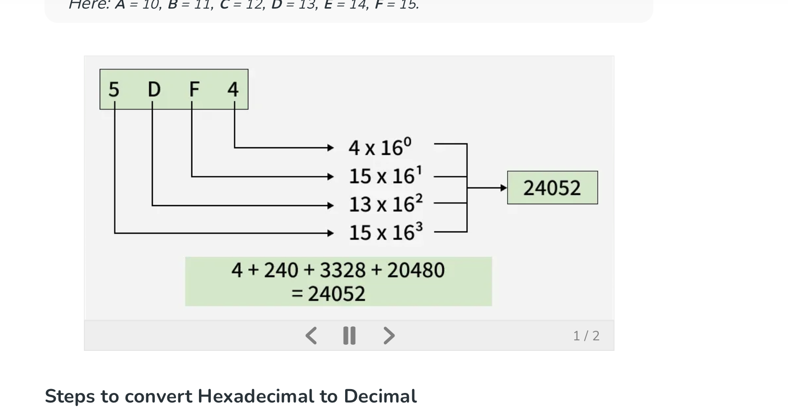

<i>Stolen from <a href="https://www.geeksforgeeks.org/maths/hex-to-decimal/">Geeks-for-Geeks.com</a></i>

### What is a hexadecimal number?

- `hex` = a numeral written in base^16
- `decimal` = a numeral written in base^10

### Hex notation

The sequence of possible values for a digit in a sequence of Hex numbers begins with the first numbers being written with standard decimal notation (`0-9`),  after which the sequence shifts to alphabetical characters, notated with (`A-F`) 

> `0, 1, 2, 3, 4, 5, 6, 7, 8, 9, A, B, C, D, E, F`

Here: **`**A**`** `= 10`, **`**B**`** `= 11`, **`**C**`** `= 12`, **`**D**`** `= 13`, **`**E**`** `= 14`, **`**F**`** `= 15`

### Example translation from Hex - Decimal

**Q:** Given an RGBA colour profile, `860eafdc`, determine the corresponding decimal values of each component (`0-255`).

**A:**
1. `86` => `(8 * 16^1) + (6 * 16^0)` => `(8 * 16) + (6 * 1)` => `(128) + (6)` => `134`
2. `0e` => `(0 * 16^1) + (14 * 16^0)` => `(0 * 16) + (14 * 1)` =>  `(0) + 14` => `14`
3. `af` =>  `(10 * 16^1) + (15 * 16^0) => (10 * 16) + (15 * 1) => (160 + 15) => 175`